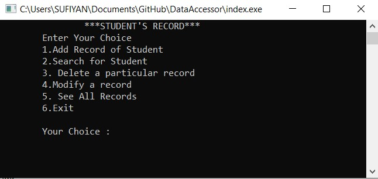
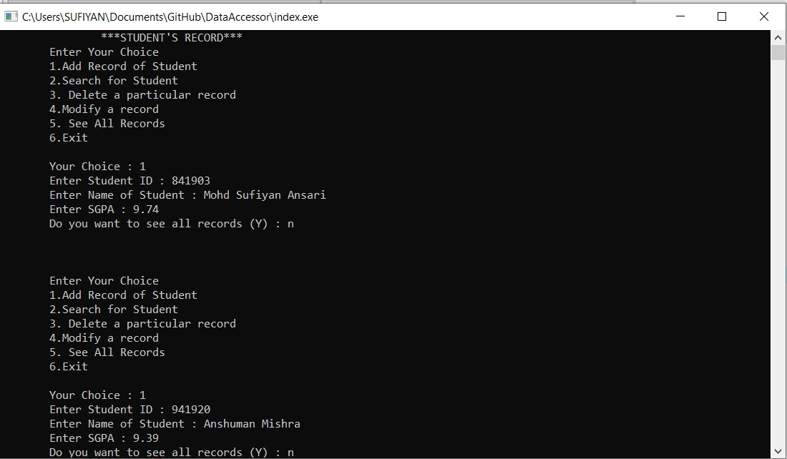
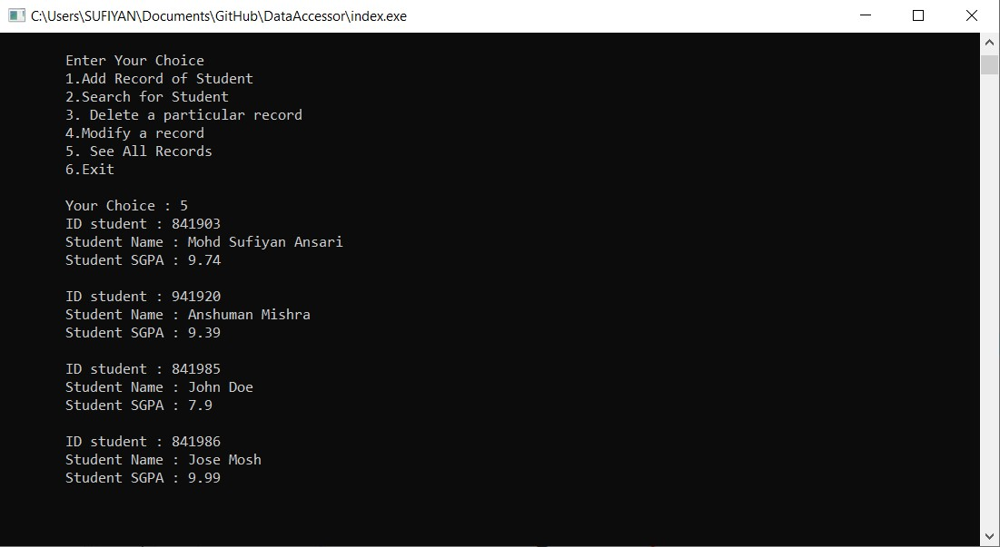
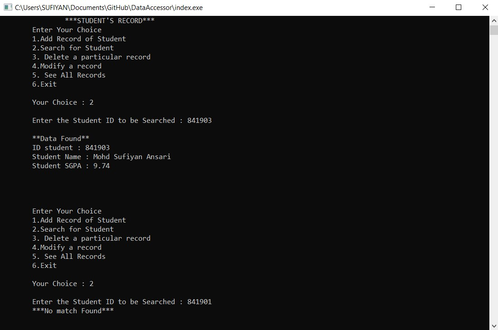
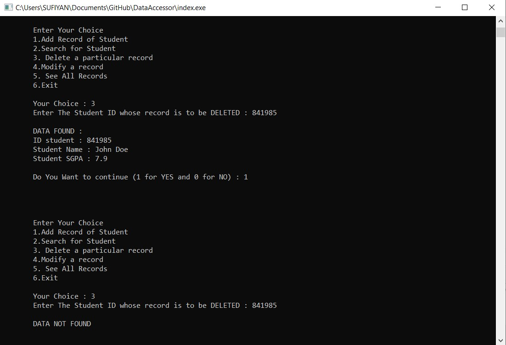

# DataAccessor

A c++ based program that allows DATA FILE HANDLING on ***BINARY DATA*** file
> If further improved by adding password in binary form, it can be used sucessfully as a database for storing students record.

### Libraries Used:
```
string
fstream
```

### Functions Used:
- Adding
- Deleting
- Searching
- Modifying
- Display

#### This generates  a local file, that will even preserve your data when opened or executed again
#### As this uses, .bat file and in ```ios::binary``` mode, data is not readable by users but machine.

### Screenshots of the Program:

- HomeScreen

<br>

- Adding Data

<br>

- Viewing Data

<br>

- Searching Data 
	- Data Found
	- Data Not Found

<br>

- Deleting Data
	- Data Deleted
	- Data is not there

